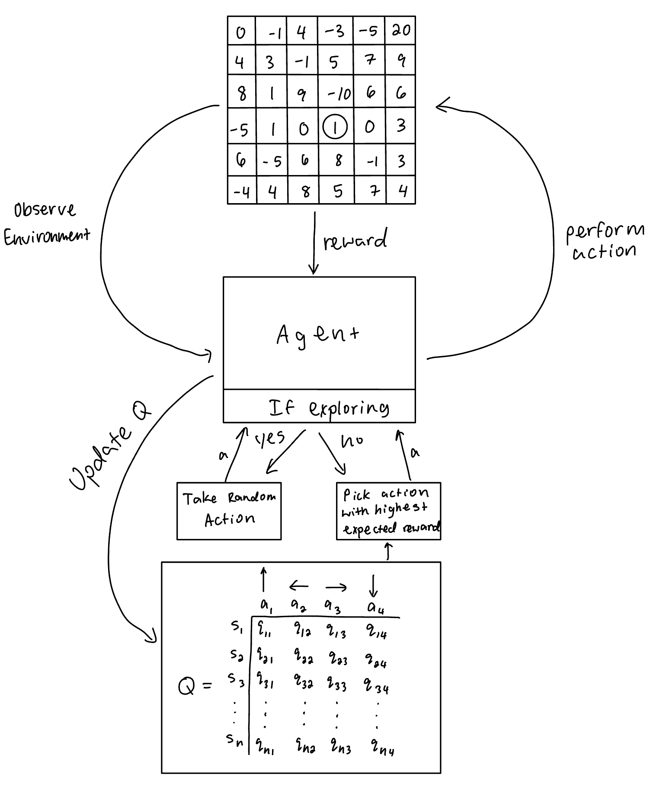
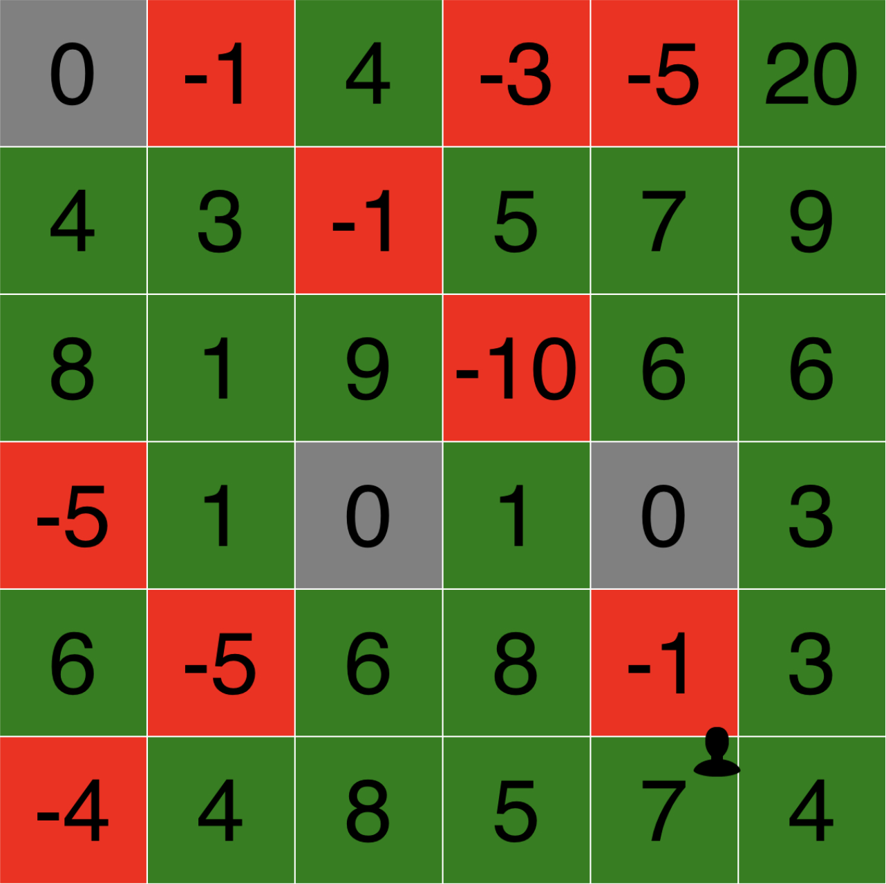
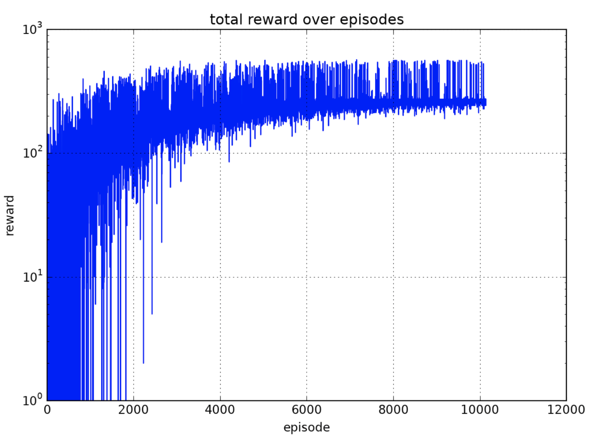

# Grid Q-Learner

## Description
This project was mainly about learning how Q-learning, a particular reinforcement learning technique for optimizing an autonomous agent’s behavior, worked at a basic level. In this environment, an agent is put in the bottom left square of an n by n grid, where each square has an integer reward value between -10 and 10 and the top right square has a high reward value. The agent’s possible actions are to move up, left, right, or down. Each epoch, the agent takes an action given its position on the grid. Using the epsilon-greedy algorithm, the agent decides whether to take an optimal action according to the Q-table or sample a random action. This epsilon value is gradually decreased every episode, or after $n^2$ actions. After each action is taken, the agent receives a reward from the environment, which is the point value of the square that the agent moves to. With this reward value, the Q-table is updated using the Bellman Optimality Equation. This process is repeated indefinitely.

## How to run
Download the repository and run `grid_q_learning.py` it in [Pythonista](https://apps.apple.com/us/app/pythonista-3/id1085978097?ls=1). Pythonista is a Python programming environment available on iOS devices. 

You can stop the program at any point and run `reward_graph.py` to see the agent's reward over time.

## Examples:

